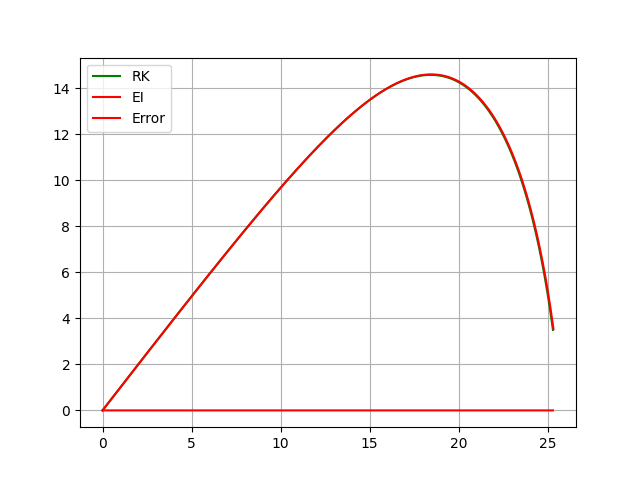
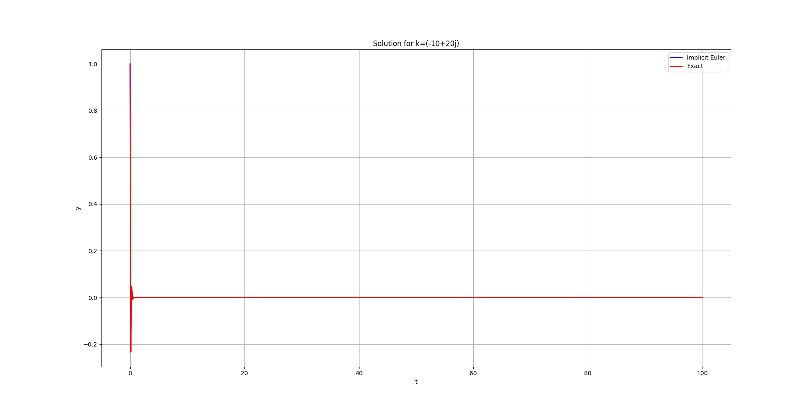

# Hit a Ball to Fixed Target<br>(Problem 1)<br>Giorgi Jorjikia 03/01/2025

## Problem Formulation

### Task Description

Develop a simulation that throws a ball to hit randomly scattered target balls in an image, using the shooting method and ball motion equations.

### Components

- **Input**: Image containing randomly scattered balls
- **Output**: Animation showing the ball trajectories hitting each target
- **Task**: Sequential targeting and hitting of balls in the image

### Mathematical Model

#### Ball Motion Equations

$\frac {dx} {dt} = v_x$\
$\frac {dy} {dt} = v_y$\
$\frac {dv_x} {dt} = - \frac k m v_x \sqrt {{v_x^2} + {v_y^2}}$\
$\frac {dv_y} {dt} = - g - \frac k m v_y \sqrt {{v_x^2} + {v_y^2}}$

### Numerical Methods

1. **Shooting Method**
   - Uses Newton's method for finding correct initial velocity and angle
   - Iteratively adjusts parameters to hit target coordinates
   - Convergence criterion: $error < 0.1$

2. **Equation for initial and boundary condition**

To simplify things we will combine some equations:

- $\frac {dl}{dt} = \begin{pmatrix}v_x \\ v_y \end{pmatrix}$

- $\frac {dv}{dt} = \begin{pmatrix}- \frac k m v_x \sqrt {{v_x^2} + {v_y^2}} \\ - g - \frac k m v_y \sqrt {{v_x^2} + {v_y^2}} \end{pmatrix}$

Now boundary conditions are $l(t_0) = \begin{pmatrix}0 \\ 0 \end{pmatrix}$ and $l(t_f) = \begin{pmatrix}x_t \\ y_t \end{pmatrix} = l_t$, where $l_t$ is the targets location

So now we have unknown vector $v(t_0) = s$ and we can find $s$ by finding roots of a function $F(s) = l(t_f) - l_t$, we can do this by solving system of linear equations $J_F(x_n)(x_{n+1}-x_n)=-F(x_n)$ and we get $(x_{n+1}-x_n)$, in other words we find the delta by with we have to change our initial guess ($J_F$ is the jacobian of the function and $F$ is the vector-valued function).

1. **Trajectory Integration**
   - Implicit Euler (Error of $O(h^2)$) & Runge-Kutta 4th order
   - Time step: $dt = 0.001s$
   - Integration continues until $y ≤ 0$ or max_time reached
   - Both methods give similar results

2. **Target Detection**
   - Canny edge detection for ball identification
   - DBSCAN clustering to group edge points
   - Center calculation for target coordinates

## Algorithm

1. **Image Processing**
   - Load input image
   - Apply Canny edge detection
   - Use DBSCAN to identify ball clusters
   - Calculate center coordinates of each cluster

2. **Trajectory Calculation**
   - For each target:
     1. Apply shooting method to find initial velocity and angle
     2. Simulate trajectory
     3. Store trajectory points for animation

3. **Animation**
   - Plot launch point and targets
   - Sequentially animate trajectories
   - Show complete paths for previous shots

## Comparing Implicit Euler & Classic RK



As we can see in this figure both methods give use almost identical results (with dt=0.001), the only difference is the time for calculation.

```text
RK: 0.07445549999829382
Euler (Implicit): 0.45609730000433046
```

## A-Stability of Implicit Euler's method

The Implicit Euler's method is A-Stable, we can verify this by finding $h$ such that when  $t \rarr \infty$ the equation $y' = ky, y(0)=1$ approaches zero when $Re(k)<0$. ($k \isin \mathbb{C}$)



As we can see with $h=0.001$ the equation approaches 0, therefore Implicit Eulers method with $h=0.001$ is truly A-Stable.

## Implementation Details

### Physical Parameters

- Air Drag $k = 0.001$
- Air Drag $k = 0.001$
- Ball mass: $m = 0.145 kg$

### Numerical Parameters

- Time step: $dt = 0.001s$
- Maximum simulation time: $4s$
- Shooting method tolerance: $0.1m$
- Maximum iterations: $100$

## Test Case


## References

- <https://www.youtube.com/watch?v=qIfxydBEdzg>
- <https://en.wikipedia.org/wiki/Shooting_method#Mathematical_description>
- <http://www.ohiouniversityfaculty.com/youngt/IntNumMeth/lecture13.pdf>
- <https://en.wikipedia.org/wiki/Newton%27s_method#Multidimensional_formulations>
- <https://en.wikipedia.org/wiki/Runge%E2%80%93Kutta_methods>
- <https://en.wikipedia.org/wiki/Stiff_equation#A-stability>
- <https://en.wikipedia.org/wiki/Backward_Euler_method>
