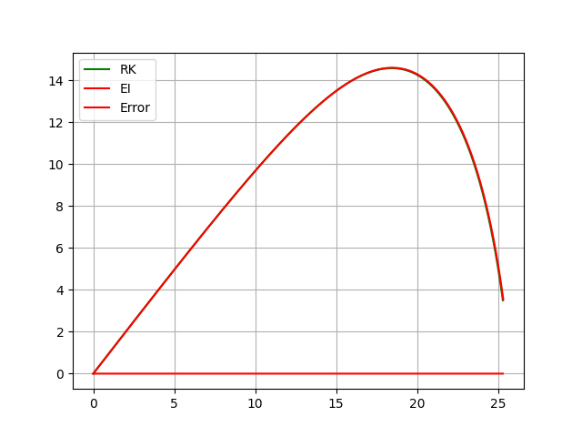
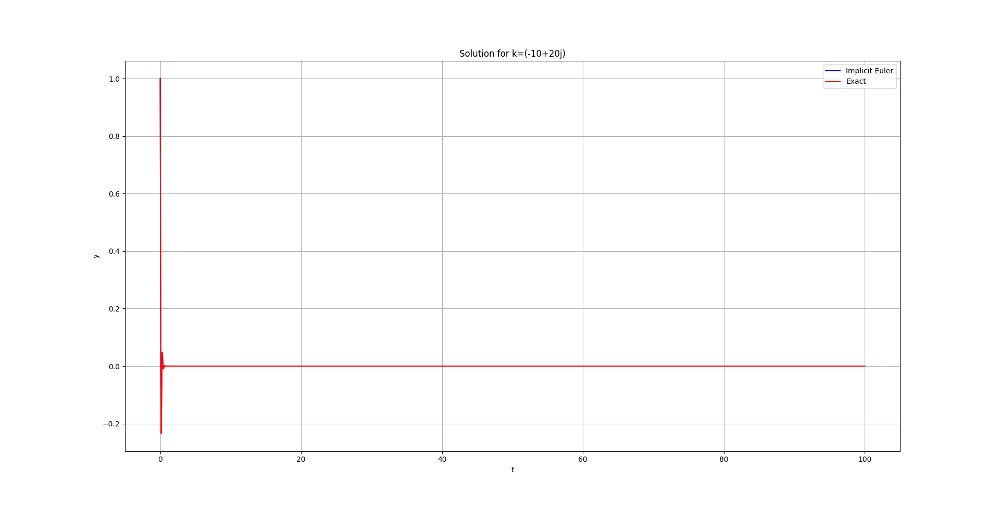

# Intercept a moving ball<br>(Problem 2)<br>Giorgi Jorjikia 07/01/2025

## Problem Formulation

### Task Description

Develop a system that tracks a moving ball from video input and calculates an interception trajectory, accounting for physical forces like gravity and air resistance.

### Components

- **Input**: Partial video of a moving ball
- **Output**: Animation showing the ball trajectory hitting the balls predicted location
- **Task**: Determining balls future location and shooting the ball at it

### Mathematical Model

#### Ball Motion Equations

$\frac {dx} {dt} = v_x$\
$\frac {dy} {dt} = v_y$\
$\frac {dv_x} {dt} = - \frac k m v_x \sqrt {{v_x^2} + {v_y^2}}$\
$\frac {dv_y} {dt} = - g - \frac k m v_y \sqrt {{v_x^2} + {v_y^2}}$

### Numerical Methods

1. **Shooting Method**
   - Uses Newton's method for finding correct initial velocity and angle
   - Iteratively adjusts parameters to hit target coordinates
   - Convergence criterion: $error < 0.1$

2. **Video Processing**
    - Frame extraction
    - Gaussian blur for noise reduction
    - Canny edge detection for ball identification
    - Contour detection for position tracking

3. **Velocity Calculation**

    Central difference method for velocity estimation:
    $v_x = \frac{x_{i+1} - x_{i-1}}{2\Delta t}$
    $v_y = \frac{y_{i+1} - y_{i-1}}{2\Delta t}$

4. **Parameter Estimation**
    - Uses consecutive velocity measurements to estimate $k/m$ and $g$
    - Applies averaging to reduce measurement noise
    - Accounts for frame rate in temporal calculations

5. **Equation for initial and boundary condition**

    To simplify things we will combine some equations:

    - $\frac {dl}{dt} = \begin{pmatrix}v_x \\ v_y \end{pmatrix}$

    - $\frac {dv}{dt} = \begin{pmatrix}- \frac k m v_x \sqrt {{v_x^2} + {v_y^2}} \\ - g - \frac k m v_y \sqrt {{v_x^2} + {v_y^2}} \end{pmatrix}$

    Now boundary conditions are $l(t_0) = \begin{pmatrix}0 \\ 0 \end{pmatrix}$ and $l(t_f) = \begin{pmatrix}x_t \\ y_t \end{pmatrix} = l_t$, where $l_t$ is the targets location

    So now we have unknown vector $v(t_0) = s$ and we can find $s$ by finding roots of a function $F(s) = l(t_f) - l_t$, we can do this by solving system of linear equations $J_F(x_n)(x_{n+1}-x_n)=-F(x_n)$ and we get $(x_{n+1}-x_n)$, in other words we find the delta by with we have to change our initial guess ($J_F$ is the jacobian of the function and $F$ is the vector-valued function).

6. **Trajectory Integration**
    - Implicit Euler (Error of $O(h^2)$) & RK
    - Time step: $dt = 0.001s$
    - Integration continues until y ≤ 0 or max_time reached
    - Both methods give similar results, but IE was chosen because it's A-Stable

## Algorithm

1. **Video Processing**
    - Load input video
    - Apply Canny edge detection
    - Contour detection for position tracking

2. **Trajectory Calculation**
    - Simulate the balls position in the future with implicit euelers method
    - Use shooting method to find the velocity so that the ball hits the targets future position

## Comparing Implicit Euler & Classic RK



As we can see in this figure both methods give use almost identical results (with dt=0.001), the only difference is the time for calculation.

```text
RK: 0.07445549999829382
Euler (Implicit): 0.45609730000433046
```
## A-Stability of Implicit Euler's method

The Implicit Euler's method is A-Stable, we can verify this by finding $h$ such that when  $t \rarr \infty$ the equation $y' = ky, y(0)=1$ approaches zero when $Re(k)<0$. ($k \isin \mathbb{C}$)



As we can see with $h=0.001$ the equation approaches 0, therefore Implicit Eulers method with $h=0.001$ is truly A-Stable.

## Implementation Details

### Numerical Parameters

- Time step: $dt = 0.001s$
- Flight time: $0.4s$
- Shooting method tolerance: $0.1m$
- Maximum iterations: $100$

## Test Cases


## References

- <https://www.youtube.com/watch?v=qIfxydBEdzg>
- <https://en.wikipedia.org/wiki/Shooting_method#Mathematical_description>
- <http://www.ohiouniversityfaculty.com/youngt/IntNumMeth/lecture13.pdf>
- <https://en.wikipedia.org/wiki/Newton%27s_method#Multidimensional_formulations>
- <https://en.wikipedia.org/wiki/Runge%E2%80%93Kutta_methods>
- <https://en.wikipedia.org/wiki/Stiff_equation#A-stability>
- <https://en.wikipedia.org/wiki/Backward_Euler_method>
